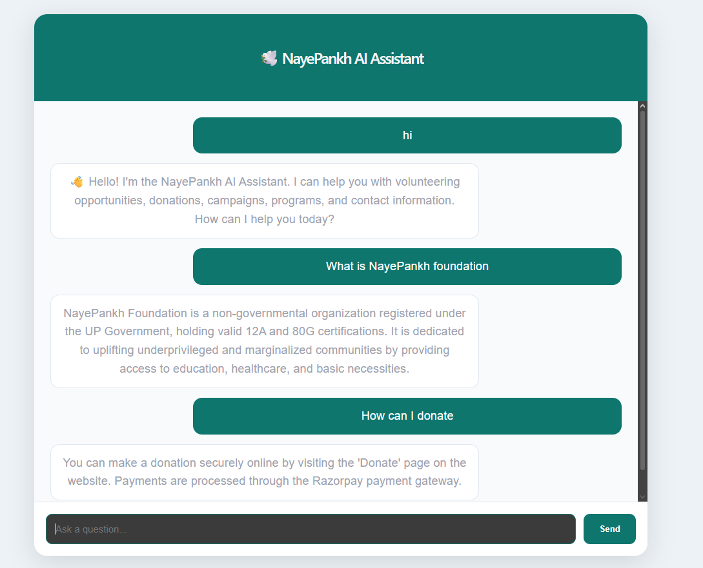
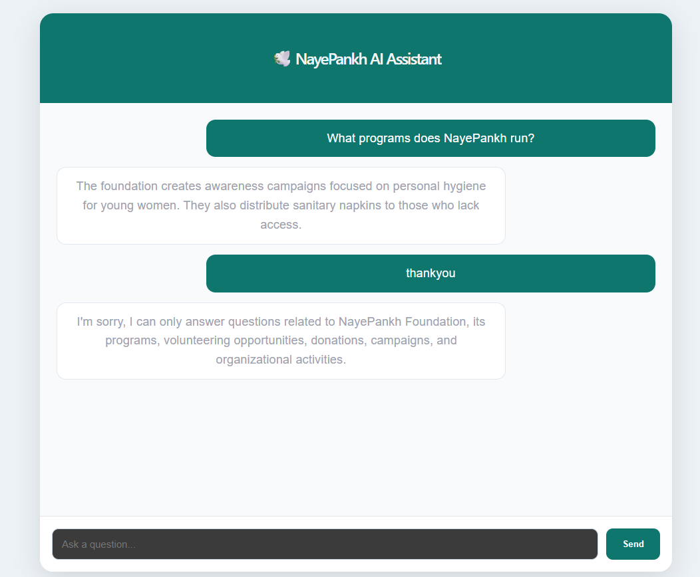
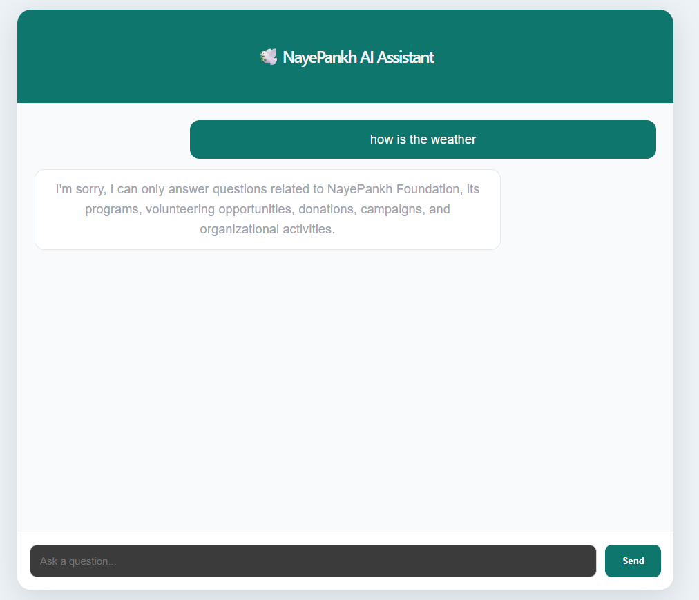

# 🕊️ NayePankh AI Assistant

## Overview

NayePankh AI Assistant is an AI-powered community assistance platform designed to improve visitor engagement and information accessibility for NayePankh Foundation.

The assistant enables users to quickly access information about volunteering opportunities, donations, campaigns, programs, contact details, and organizational activities through a conversational interface.

This project was developed as a practical, cost-effective solution that can be integrated into the existing NayePankh Foundation website without requiring paid AI APIs.

---

## Problem Statement

Visitors often need to browse multiple pages to find information related to:

* Volunteering opportunities
* Donation methods
* Foundation programs
* Campaigns and initiatives
* Contact information
* Organizational activities

This can lead to poor user experience and reduced engagement.

---

## Proposed Solution

NayePankh AI Assistant provides an intelligent chat-based interface that allows visitors to ask questions naturally and receive instant responses from a structured knowledge base.

The system uses TF-IDF vectorization and cosine similarity to identify the most relevant answer from a curated FAQ dataset.

---

## Key Features

### 🤖 AI-Powered Information Retrieval

* TF-IDF based semantic search
* Cosine similarity matching
* Intelligent FAQ retrieval

### 💬 Interactive Chat Interface

* Modern conversational UI
* Real-time responses
* Enter key support
* Auto-scrolling chat history

### 👋 Smart Conversational Handling

* Greeting recognition
* Thank-you responses
* Goodbye responses
* Friendly fallback responses

### 📚 Knowledge Base

* Structured NGO FAQ dataset
* Volunteer information
* Donation guidance
* Program and campaign information
* Contact and support details

### 🎯 User Experience Enhancements

* Welcome screen
* Suggested questions
* Responsive design
* Professional NGO-themed interface

---

## System Architecture

```text
User
  │
  ▼
React Frontend
  │
  ▼
FastAPI Backend
  │
  ▼
TF-IDF Search Engine
  │
  ▼
FAQ Knowledge Base
  │
  ▼
Relevant Response
```

---

## Technology Stack

### Frontend

* React
* Vite
* Axios
* CSS

### Backend

* FastAPI
* Python

### AI Components

* Scikit-Learn
* TF-IDF Vectorizer
* Cosine Similarity

## Screenshots

### Welcome Screen



### Volunteer Query



### Fallback Response



## Project Structure

```text
nayepankh-ai-assistant/

├── frontend/
│   ├── src/
│   ├── public/
│   ├── App.jsx
│   └── App.css
│
├── backend/
│   ├── main.py
│   ├── search.py
│   ├── faq.json
│   ├── greetings.json
│   ├── greeting_responses.json
│   └── requirements.txt
│
└── README.md
```

---

## How It Works

1. User submits a question.
2. The backend checks for greetings, thanks, or goodbye messages.
3. If no conversational match is found:

   * TF-IDF vectorization is applied.
   * Cosine similarity identifies the most relevant FAQ.
4. The best answer is returned to the user.
5. If no suitable match exists, a fallback response is provided.

---

## Example Queries

### Volunteer Information

**User**

```
How can I volunteer?
```

**Assistant**

```
You can express your interest in joining the team by using the Contact Us form or emailing your details to the foundation.
```

---

### Donation Information

**User**

```
How can I donate?
```

**Assistant**

```
The foundation accepts contributions through its official donation channels and support programs.
```

---

### Greeting

**User**

```
Hello
```

**Assistant**

```
Hello! I'm the NayePankh AI Assistant.

I can help you with:
• Volunteering opportunities
• Donations
• Campaigns & Programs
• Contact Information

How can I help you today?
```

---

## Future Enhancements

* Retrieval-Augmented Generation (RAG)
* Local LLM Integration using Ollama
* Multilingual Support
* Voice-Based Interaction
* WhatsApp Integration
* Volunteer Recommendation System
* Campaign Discovery Assistant
* Analytics Dashboard

---

## Impact

The NayePankh AI Assistant enhances accessibility and engagement by enabling visitors to obtain information quickly through natural conversation.

The solution demonstrates how AI can be practically applied within non-profit organizations to improve communication, increase participation, and streamline information delivery.

---

## Author

Student at Chandigarh University
